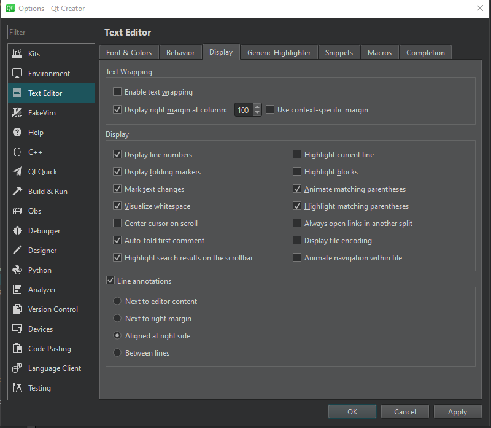
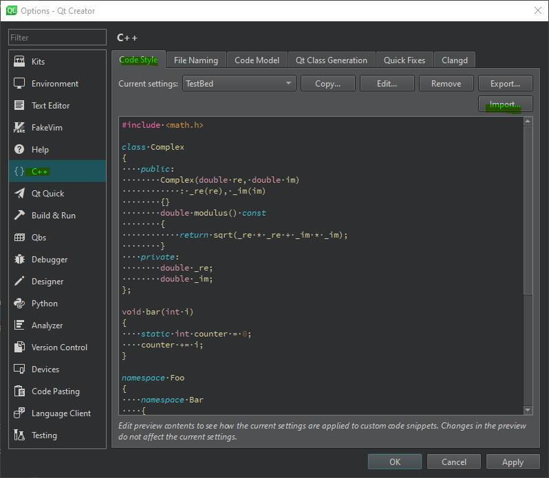
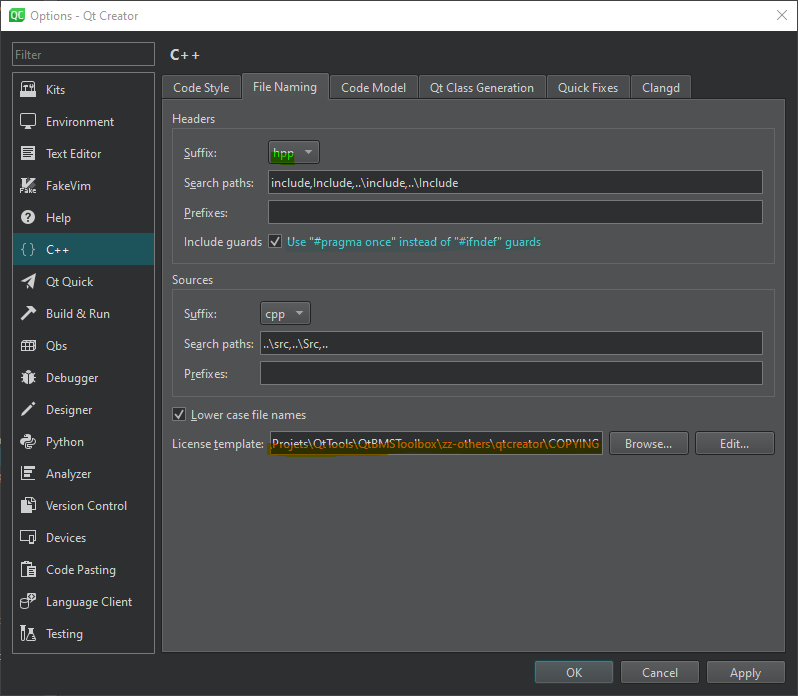
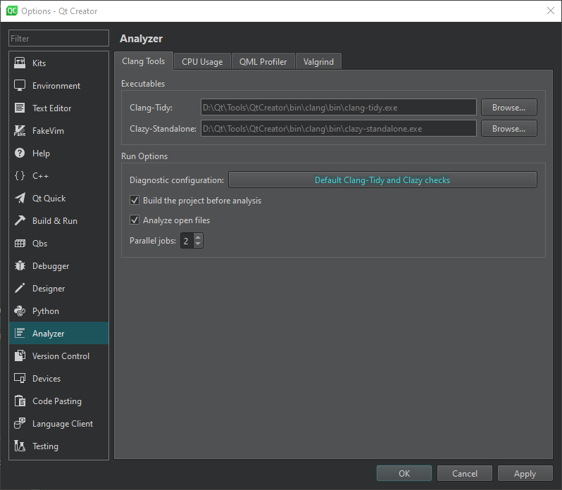
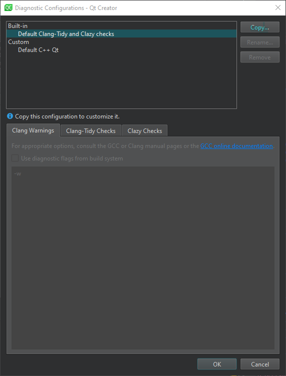
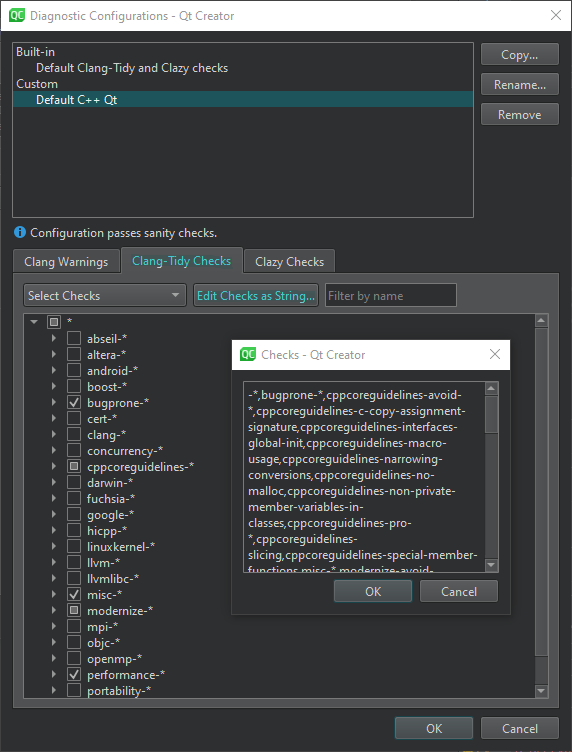

<!--
SPDX-FileCopyrightText: 2024 Benoit Rolandeau <benoit.rolandeau@allcircuits.com>

SPDX-License-Identifier: LicenseRef-ALLCircuits-ACT-1.1
-->

# ACT Qt Toolbox

## Table of contents

- [ACT Qt Toolbox](#act-qt-toolbox)
  - [Table of contents](#table-of-contents)
  - [Introduction](#introduction)
  - [Qt](#qt)
  - [OS and compiler](#os-and-compiler)
  - [Repository storage strategy choice](#repository-storage-strategy-choice)
  - [Project tree description](#project-tree-description)
  - [Our internal process](#our-internal-process)
  - [Licenses](#licenses)
    - [Introduction](#introduction-1)
    - [FAQ](#faq)
      - [Can I use freely this code in my projects?](#can-i-use-freely-this-code-in-my-projects)
      - [Can I modify this code?](#can-i-modify-this-code)
      - [Do I need to share my modification on this repository?](#do-i-need-to-share-my-modification-on-this-repository)
      - [Can I use this code in commercial project? Do I need to pay something?](#can-i-use-this-code-in-commercial-project-do-i-need-to-pay-something)
      - [Can I resell this code?](#can-i-resell-this-code)
      - [You say we can use freely this code in commercial project but we can't resell it, I don't understand!](#you-say-we-can-use-freely-this-code-in-commercial-project-but-we-cant-resell-it-i-dont-understand)
      - [May I add a package or a library with a different license of ALLCircuits-ACT-1.1?](#may-i-add-a-package-or-a-library-with-a-different-license-of-allcircuits-act-11)
      - [May I add a class with a different license of the other classes in the lib or package?](#may-i-add-a-class-with-a-different-license-of-the-other-classes-in-the-lib-or-package)
  - [Usage best practices](#usage-best-practices)
    - [Introduction](#introduction-2)
    - [If you work by one task/one branch (_recommended_)](#if-you-work-by-one-taskone-branch-recommended)
    - [If you only work on one branch](#if-you-only-work-on-one-branch)
    - [Attention](#attention)
  - [Use shared dest directory](#use-shared-dest-directory)
  - [Qt code packages](#qt-code-packages)
    - [Presentation](#presentation)
    - [Packages inclusion](#packages-inclusion)
      - [Inclusion](#inclusion)
      - [Inter dependencies](#inter-dependencies)
    - [Packages list](#packages-list)
    - [How to contribute](#how-to-contribute)
      - [Preamble](#preamble)
      - [Add a new utility package](#add-a-new-utility-package)
      - [Update an utility package](#update-an-utility-package)
  - [Qt code libraries](#qt-code-libraries)
    - [Presentation](#presentation-1)
    - [Link your libraries or applications to the generated binary](#link-your-libraries-or-applications-to-the-generated-binary)
    - [Libraries list](#libraries-list)
      - [QtPeakCanLib](#qtpeakcanlib)
        - [Presentation](#presentation-2)
        - [Dependencies](#dependencies)
      - [QtSerialLinkLib](#qtseriallinklib)
        - [Presentation](#presentation-3)
        - [Dependencies](#dependencies-1)
      - [QtVisaComLib](#qtvisacomlib)
        - [Presentation](#presentation-4)
        - [Dependencies](#dependencies-2)
    - [How to contribute](#how-to-contribute-1)
      - [Preamble](#preamble-1)
      - [Add a new library](#add-a-new-library)
  - [Qt Creator configuration](#qt-creator-configuration)
    - [Text editor](#text-editor)
    - [Code style](#code-style)
    - [Headers suffix](#headers-suffix)
    - [Pragma once](#pragma-once)
    - [Clang Tools](#clang-tools)
    - [Create a diagnostic configuration](#create-a-diagnostic-configuration)


## Introduction

This repository contains three kinds of files:

- Utility source code packages for Qt projects (which can be included in your libraries and
applications)
- Qt Libraries to be used in your Qt projects
- Useful files to configure Qt Creator

The licensing is managed by reuse, read [README-reuse.md](README-reuse.md) for more information.

## Qt

The classes contain in this repository are built with Qt (open source version).

The supported Qt version is the latest Qt5 open source LTS: 5.15.2.

We don't support Qt 6 and don't plan to.

In future, we plan to change our strategy of developement in order to no more use Qt. Even if Qt is
a great framework, we are not in harmony with the Qt choices for open source in the last past years.

To find the open source installer in the Qt website:
[Open source Qt installer](https://www.qt.io/download-qt-installer-oss)

## OS and compiler

Most code can be built on:

- Windows:
  - MSVC2019
  - MinGW
- Linux:
  - GCC

Nevertheless, for some libraries or utilities, specific features haven't developed yet for all the
OS (in that case, a warning is printed).
Moreover, some externals libraries we use in Windows, have been built with MSVC. Therefore, to use
them in Windows, you need to use MSVC.

Our strategy is to support specific features on OS or compiler when we need to in internals or
clients projects. For two reasons:

- Our time is precious (like yours) and we haven't a lot of time to spare — outside projects —
- We considere that our code contains less bugs when we really use it in a project, because we test
it in real situation and we are more dedicated to what we are doing, it's more concret,
- At last, we only develop what we need (and not what we may need in future), and so the code is
more easily/often maintained. Because we need it once, there are more chances that we need it once
again.

## Repository storage strategy choice

We have made the choice to store all our utilities and libs classes to the same repository (instead
of having multiple git repository). And this, for multiple reasons :

- The repository doesn't contain large files; therefore, even if there are several libraries and
utilities classes, the repository size is negligible.
- In your projects, you only build utilities classes you include; therefore, the size of your
libraries and executables won't be larger because there are more code in the submodule repo
- The usage of submodules can be tricky when working with branches and tasks: at each task, you have
to create a branch in each repository you update, so if you update multiple utilities, the amount of
non-pertinent work increase.

## Project tree description

```
./
├── .reuse/               [tree-1]
├── gitlac-ci/            [tree-2]
├── jenkins/              [tree-3]
├── LICENSES/             [tree-1]
├── qtlibs/
├── qtutilities/
├── tools/
│   └── reuse-annotate.sh [tree-1]
├── zz-others/
├── .gitignore
├── .gitlab-ci.yml        [tree-2]
├── .mailmap              [tree-1]
├── Jenkinsfile           [tree-3]
├── ActQtToolbox.pro
├── ActQtToolboxRoot.pro
├── README-reuse.md       [tree-1]
├── README.md
├── default-build-params.pri
└── import-build-params.pri
```

With:

- [tree-1]: Those files and folders are linked to the reuse tool, see
[README-reuse.md](README-reuse.md) for more informations
- [tree-2]: Those files and folders are linked to our GitLab private server
- [tree-3]: Those files and folders are linked to our jenkins server

## Our internal process

Internally, we mirror this project on our private community GitLab server and use Jenkins as CI.

We use GitLab for our private repositories and GitHub for the public. For now, we mainly use Jenkins
as CI and for some linting features (as REUSE linting) we use the CI of GitLab.

## Licenses

### Introduction

All the utility classes use our special license :
[ALLCircuits-ACT-1.1](LICENSES/LicenseRef-ALLCircuits-ACT-1.1.txt).

The spirit of this license is to share our code, fruit or our skills and experience, to anyone. You
are free to use and modify it. But we also want to protect our author rights and keep our names on
this code; we don't want to have people trying to resell it.

### FAQ

#### Can I use freely this code in my projects?

Yes, there is no licenses to pay.

#### Can I modify this code?

Yes, just keep our copyright headers on files and feel free to add your names in them.

#### Do I need to share my modification on this repository?

No. However, you are more than welcome to do it! If you find a bug or want to improve the code,
feel free to share your skills and experience.

#### Can I use this code in commercial project? Do I need to pay something?

You are free to use this code in commercial projects and you don't have to pay anything.

However, you have to keep the header licenses in the classes and have our license in your
repositories. It's not because it's free that you can take a full ownership of what we have done.

#### Can I resell this code?

No, it's free to use to everyone, we want to keep it that way.

#### You say we can use freely this code in commercial project but we can't resell it, I don't understand!

When you use this code in your projects, what you sell it's your project, your work: you only use
our code to make your project works. That's fine to us.

However we don't want people trying to sell this code to their clients as their own; and so sell a
work they haven't done. Whether through a license which covers this code or by a rebranding of all,
or nearly all, the content of this repository.

#### May I add a package or a library with a different license of [ALLCircuits-ACT-1.1](LICENSES/LicenseRef-ALLCircuits-ACT-1.1.txt)?

Yes you can, but:

- it has to be a license which keeps the spirit of this repository, and
- it is not a contagious license

> [!NOTE]
> To avoid to have multiple licenses in one package or library, we only accept one license by
> package or library (this doesn't apply to the code you integrate from other repo via submodule).

#### May I add a class with a different license of the other classes in the lib or package?

No, see the previous question.

## Usage best practices

### Introduction

From our experience, the best way of using this code depends on your work process.

Because all those packages and libraries may be used in a multitude of projects, we are particulary
strict on our code reviews.

It's always welcome to create unit tests for those packages/libraries.

The source code contained in [qtutilites](qtutilites) is built into your project (this doesn't create
a separate dll or lib).

The source code contained in [qtlibs](qtlibs) creates separate dll and lib.

### If you work by one task/one branch (_recommended_)

If you work by task and create a temporary branch for each task — _what we recommend; even if you
are alone on your project_ —, the best way to use this code is to add this repository as submodule
of your Git project.

When you have to update the content of this repository, you can create a branch on your fork which
has the same name as the branch on your repository, and point on it.

### If you only work on one branch

If you only work on one branch, from our experience, the best way to use this code is to copy/paste
what you want to use into your project.

Then, in your repository, you can modify the code to correct problems or to add some new features,
without the need of creating a git sub module, managing the branches and intermediate commits, etc.

At the end of your project, you know that you have fixed all the problems before the final release :
all your additions and modifications to this code are more likely clean, then you can create a merge
request to this repository in order to merge all your beautiful and clean work.

### Attention

Those utilities and libraries have to be written to be used in Windows and Linux, and also to be
built with Mingw and MSVC. Therefore, if possible, you have to abstract the OS from the feature.

If it's impossible, or it will ask too much work to support both, in the ".pri" file (for utilities)
or ".pro" file (for libraries) you have to raise an error if the code is used in the wrong
conditions.

## Use shared dest directory

When you work in project and create multiple libraries and applications, it may be tricky to have
all the binaries in places where they can link together.

That's why we create the [import-build-params.pri](import-build-params.pri) file. It searches
common build parameters info to share between all the libraries and application built in the
project.
The `import-build-params.pri` file tries to find all the `default-build-params.pri` and
`build-params.pri` files and goes upward (in the git project, it goes through git submodule)

To use it, you have to include this file in all the `.pro` files of your project.

You may override the default behaviours of the [default-build-params.pri](default-build-params.pri)
file by adding one of `default-build-params.pri`, `build-params.pri` files in one of the top git
repository.

The variable `BUILD_PATH` is given to the `default-build-params.pri`, `build-params.pri` and contain
the absolute path of the topest git repository folder where a `default-build-params.pri` or
`build-params.pri` file is present.

The `*build-params.pri` file has (at least) to fill the `DESTDIR_LIBS` variable with the path of the
folder where you want to put all the binaries files

## Qt code packages

### Presentation

All the subfolders contain in the directory: [qtutilites](qtutilites), are useful classes which may
be included in your Qt projects.

In Qt Creator, you can see, build and tests all those packages thanks to the
[ActQtToolbox.pro](ActQtToolbox.pro) file. Some have unit tests.

Those utility classes are added in your ".pro" file thanks to the ".pri" files. The code is added
and built with your code in the same lib and/or application.

The classes are grouped thematically and one groupe may be dependent of anothers.

### Packages inclusion

#### Inclusion

In your ".pro" and ".pri" files you may include the wanted packages:

```
include($$QTUTILITIES/definesutility/definesutility.pri)
```

Where:

- `QTUTILITIES` variable is equals to the absolute path of [qtutilites](qtutilites) folder

#### Inter dependencies

Some packages are dependents of others. The order of your inclusions is important. In your ".pro"
or ".pri" files, when you want to include a package, you have to include all its dependencies BEFORE.

For instance, with the packages `byteutility` and `definesutility`:

```
include($$QTUTILITIES/definesutility/definesutility.pri)
include($$QTUTILITIES/byteutility/byteutility.pri)
```

Where:

- `byteutility` package depends on `definesutility`
- `QTUTILITIES` variable is equals to the absolute path of [qtutilites](qtutilites) folder

### Packages list

| Name                | DEFINES keyword        | Description                                                                                                                                                                                                                                                              | At least C++ version | Dependencies                                                                                               | Unit tests                                          |
| ------------------- | ---------------------- | ------------------------------------------------------------------------------------------------------------------------------------------------------------------------------------------------------------------------------------------------------------------------ | -------------------- | ---------------------------------------------------------------------------------------------------------- | --------------------------------------------------- |
| asyncutility        | ASYNC_BMS_LIB          | Those classes are useful to manage asynchronicity between threads. Or in waiting signals.                                                                                                                                                                                | C++11                | - waitutility                                                                                              | None                                                |
| byteutility         | BYTE_BMS_LIB           | Those classes are useful to manage bit and bytes from integers. But also to manage endianess.                                                                                                                                                                            | C++11                | - definesutility                                                                                           | Partial cover (miss some utests on class functions) |
| canutility          | CAN_BMS_LIB            | Contains helper classes and methods to extend the Qt CAN Bus classes                                                                                                                                                                                                     | C++11                | - byteutility <br> - serialbus (QT module)                                                                 | None                                                |
| collectionutility   | COLLECTION_BMS_LIB     | Those classes extend the usage of QMap and QHash classes                                                                                                                                                                                                                 | C++11                | -                                                                                                          | None                                                |
| colorutility        | COLOR_BMS_LIB          | Those classes contains the Angular Material colors and also useful classes to modify colors (get darker color, etc...)                                                                                                                                                   | C++11                | -                                                                                                          | None                                                |
| crcutility          | CRC_BMS_LIB            | Those classes are useful to create and check particular CRC                                                                                                                                                                                                              | C++11                | - byteutility                                                                                              | None                                                |
| definesutility      | DEFINES_BMS_LIB        | This contains particular useful DEFINES and MACROS which may be used in projects, and used identically with GCC and MSVC                                                                                                                                                 | Standard C++         | -                                                                                                          | None                                                |
| elfutility          | ELF_BMS_LIB            | Those classes are helpful to manage ELF files. This package is based on the open source ELFIO project: https://github.com/serge1/ELFIO (the source is built with our project), we add a thin layer over the lib to use it with our project and Qt.                       | C++11                | - [ELFIO](https://github.com/serge1/ELFIO)                                                                 | None                                                |
| fileutility         | FILE_BMS_LIB           | Those classes extend the usage of files in Qt                                                                                                                                                                                                                            | C++11                | -                                                                                                          | None                                                |
| handlerutility      | HANDLER_BMS_LIB        | Contains handlers to help the management of class instances                                                                                                                                                                                                              | C++11                | -                                                                                                          | None                                                |
| intelhexfileutility | INTEL_HEX_FILE_BMS_LIB | Those classes are helpful to manage intel HEX files                                                                                                                                                                                                                      | C++11                | - byteutility                                                                                              | Full cover                                          |
| jsonutility         | JSON_BMS_LIB           | Those classes are helpful to manage JSON objects                                                                                                                                                                                                                         | C++11                | - definesutility                                                                                           | None                                                |
| logsutility         | LOGS_BMS_LIB           | Contains classes to manage logs in application and libraries with different strategies                                                                                                                                                                                   | C++11                | - threadutility <br> - fileutility                                                                         | None                                                |
| managersutility     | MANAGERS_BMS_LIB       | Those classes are helpful to create managers and global manager for your project.                                                                                                                                                                                        | C++11                | - definesutility                                                                                           | None                                                |
| numberutility       | NUMBER_BMS_LIB         | Defines a class to manager decimal numbers with precisions                                                                                                                                                                                                               | C++14                | - definesutility <br> - byteutility                                                                        | Full cover                                          |
| processutility      | PROCESS_BMS_LIB        | Contains classes which help the call of sub process                                                                                                                                                                                                                      | C++11                | - definesutility <br> - waitutility                                                                        | None                                                |
| statemachineutility | STATE_MACHINE_BMS_LIB  | Those classes extend the usage of state machine which can be offered by Qt                                                                                                                                                                                               | C++11                | -                                                                                                          | None                                                |
| statisticsutility   | STATS_BMS_LIB          | Contains classes to do statistics in your code                                                                                                                                                                                                                           | C++11                | - collectionutility                                                                                        | None                                                |
| stringutility       | STRING_BMS_LIB         | Those classes extend the usage of QString class                                                                                                                                                                                                                          | C++11                | -                                                                                                          | None                                                |
| threadutility       | THREAD_BMS_LIB         | Those classes extend the usage of threads, which can be offered by Qt                                                                                                                                                                                                    | C++11                | - waitutility                                                                                              | None                                                |
| ticutility          | TIC_BMS_LIB            | Those classes are helpful to produce TIC in project                                                                                                                                                                                                                      | C++14                | - managersutility                                                                                          | None                                                |
| translationutility  | TRANSLATION_BMS_LIB    | Those classes extend the usage of translation features                                                                                                                                                                                                                   | C++11                | -                                                                                                          | None                                                |
| waitutility         | WAIT_BMS_LIB           | Defines classes to wait events, this is thread safe and doesn't block the event loops.                                                                                                                                                                                   | C++11                | - definesutility                                                                                           | None                                                |
| yamlutility         | YAML_BMS_LIB           | Defines classes to use YAML in Qt. Qt has no classes to manage YAML files, therefore we use the external project yq: https://github.com/mikefarah/yq to transform YAML files to JSON files (JSON files can be managed by Qt). We use and call yq as an external process. | C++11                | - [yq](https://github.com/mikefarah/yq) <br> - definesutility <br> - managersutility <br> - processutility | None                                                |

### How to contribute

#### Preamble

Please read first the [contributing](TODO) page in our dedicated [repository](TODO).

#### Add a new utility package

- [ ] A package is always managed by a `.pri` file and not a `.pro` file.
- The `.pri` file must at least contain:
  - [ ] a verification of the expected C++ version _(C++11, 14, 17... ?)_
  - [ ] the checking of the inclusion of third-party packages
  - [ ] the adding of an unique name in `DEFINES` variable
  - [ ] the adding of the code sources path in the `INCLUDEPATH` variable
  - [ ] the adding of c++ sources and headers files

```
# Test if the main application is using at least C++11, if not returns an error when compiling
c++1* | c++2* {
    # At least C++11 - OK
} else {
    error($${TARGET} requires at least c++11)
}

!contains(DEFINES, DEFINES_BMS_LIB) : error("$${TARGET} (WAIT_BMS_LIB) requires DEFINES_BMS_LIB")

WAIT_LIB_ROOT = $$absolute_path(.)

DEFINES *= WAIT_BMS_LIB

INCLUDEPATH *= $$WAIT_LIB_ROOT/

# API
HEADERS *= $$WAIT_LIB_ROOT/waithelper.hpp
SOURCES *= $$WAIT_LIB_ROOT/waithelper.cpp
```

- [ ] The name of the utility package must end by `*utility`. The folder name must be equivalent to
  the pri file name.
- [ ] Don't forget to include the utility pri file in the [ActQtToolbox.pro](ActQtToolbox.pro) file.
- [ ] Don't forget to include the utility package description in the [packages list](#packages-list)
  table.

#### Update an utility package

When updating an utility package:

- [ ] please check your dependencies to other utility packages
  - [ ] verify you haven't add circular inderdepencies
  - [ ] verify you have added the inclusion checking in `.pri` file

## Qt code libraries

### Presentation

All the subfolders contain in the directory: [qtlibs](qtlibs), are self-sufficient libraries.

They may be easily linked to applications or other libraries, thanks to the `import-qt*lib.pri`
files.

In Qt Creator, you can see, build and tests all those libraries thanks to the
[ActQtToolbox.pro](ActQtToolbox.pro) file.

### Link your libraries or applications to the generated binary

Each library has its own `import-qt*lib.pri` file. To easily link a library with your project, you
should include the `.pri` file to your `.pro` file.

### Libraries list

#### QtPeakCanLib

##### Presentation

This library is helpful to use the external PEAK CAN lib with our Qt environment. The entry point of
the lib is a singleton manager which manages multy entry points and threading.

##### Dependencies

This library depends on a third-party library:
[PEAK Can Basic dll](https://www.peak-system.com/PCAN-Basic.239.0.html)

To build the library, you have to create this folder tree and add those files:

```
qtpeakcanlib/
├── 3rdparty/
|   ├── include/
|   |   └── PCANBasic.h
|   ├── lib_x64/
|   |   ├── PCANBasic.dll
|   |   └── PCANBasic.lib
|   ├── lib_x86/
|   |   ├── PCANBasic.dll
|   |   └── PCANBasic.lib
└── src/
```

Create a `3rdparty` folder and add three others folders in it: `include`, `lib_x64` and `lib_x86`.

In the `include` folder you have to add the `PCANBasic.h` file which is the header file to request
the dll from.

In the `lib_x64` folder, you have to add the built dll and lib for 64bits width in it.

In the `lib_x86` folder, you gave to add the built dll and lib for 32bits width in it.

#### QtSerialLinkLib

##### Presentation

This library is helpful to manage serial link. The entry point of the lib is a singleton manager
which manages multy entry points and threading.

##### Dependencies

No dependencies, the library is based on the `serialport` Qt package.

#### QtVisaComLib

##### Presentation

This library is helpful to use the external VISA lib with our Qt environment. The entry point of
the lib is a singleton manager which manages multy entry points and threading.

##### Dependencies

This library depends on a third-party library: which is a Visa COM lib. For now, we only have tested
with National Instrument Visa Com lib.

To build the library, you have to create this folder tree and add those files:

```
qtvisacomlib/
├── 3rdparty/
|   ├── include/
|   |   ├── visa.h
|   |   ├── visatype.h
|   |   └── vpptype.h
|   ├── lib_x64/
|   |   └── visa64.lib
|   ├── lib_x86/
|   |   └── visa32.lib
└── src/
```

Create a `3rdparty` folder and add three others folders in it: `include`, `lib_x64` and `lib_x86`.

In the `include` folder you have to add the `PCANBasic.h` file which is the header file to request
the dll from.

In the `lib_x64` folder, you have to add the built dll and lib for 64bits width in it.

In the `lib_x86` folder, you gave to add the built dll and lib for 32bits width in it.

### How to contribute

#### Preamble

Please read first the [contributing](TODO) page in our dedicated [repository](TODO).

#### Add a new library

To create new libraries, you have to keep in mind one thing: the library may be called by several
processes in a context of multi-threading. Therefore, your have to think of how to manage
multi-threading.

The recommended way is to have a singleton class as entrypoint and QSharedPointer to access shared
instances.

Don't forget to create a `import-qt*lib.pri` for your lib which will help future developpers.

## Qt Creator configuration

### Text editor

In our code **we set the right ruler at 100 characters**. To edit it in Qt Creator, you have to set
it here:



### Code style

To automatically format the code, we use a particular "Code Style", which is available in the
repository here: [qt-style.xml](zz-others/qtcreator/qt-style.xml). You can import it in your Qt
creator here:



### Headers suffix

By default, and if the project hasn't a different historical way to manage it, all the headers
suffixes have to be: `hpp`, for C++ (it's better to differentiate C and C++ headers).

To edit it _(highlighted in green)_:



### Pragma once

Because all the compiler we use are supporting `#pragma once`, we set it by default in Qt creator
(instead of IFNDEF... in headers) _(highlighted in blue)_:


### Clang Tools

In our project we use particular Clang options. To use them, you have to:

### Create a diagnostic configuration

First, go to `Options / Analyzer / Clang Tools` page, and in the section `Run Options` clicks on
the `Diagnostic configuration` button:



Second, copy the `Default Clang-Tidy and Clazy checks` option and name the new custom config as you
want (we need to copy it because we can't change the value of the default config):



Third, select the custom config you created and go to the `Clang-Tidy Checks` tab. Then, click on
the `Edit Checks as String...` button to open the pop-up:



Fourth, copy/paste the content of the file:
[ClangTidyChecks.txt](zz-others/qtcreator/ClangTidyChecks.txt) into the pop-up.

Finally, validate everything.
